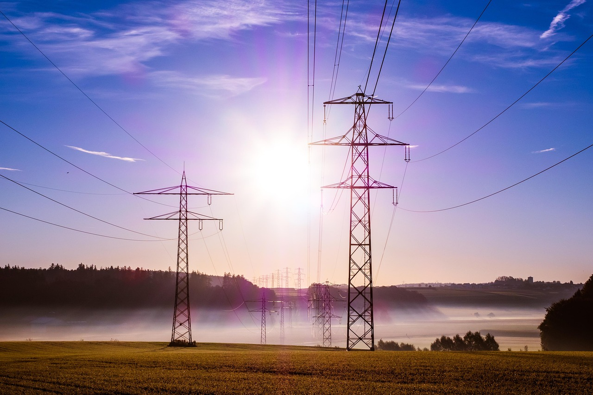

---
hide:
  - toc
---

# Overview

This demo case demonstrates functionality in [FRAM open-source modelling framework]({{ framlinks.fram }}). 

The demo case is modelling of the present-day European power market with focus on the Nordic region using [JulES open-source power market model]({{ framlinks.jules }}). 

The case is based on openly available data from different data providers, such as [the Norwegian Water Resources and Energy Directorate (NVE)]({{ framlinks.nve }}), ENTSO-E and others. Detailed information about the data sources and the dataset can be found in [dataset repository]({{ framlinks.dataset }}).  

Important! Modelling in this demo case is by no means meant to be realistic. It is only used for demonstration purposes and must not be used for real analyses or investment decisions. NVE does not stand for the assumptions or the model results in this demo. Users must be aware of possible errors and inaccuracies in the dataset. NVE is not liable for any direct or indirect losses as a result of the use of the demo or in connection with copying or further distribution of the information in the modelling in this demo. 

**Features in FRAM that we want to demonstrate in this demo:**

* model-independent database and a solid database handling package that can be adjusted depending on your needs
* efficient processing of large data amounts 
* smart and innovative system for data transformation for the given power market model 
* easy aggregation using core model

{ align=right }

*Image © [NVE]({{ framlinks.nve }}) High-voltage power line in Sognefjellet*
